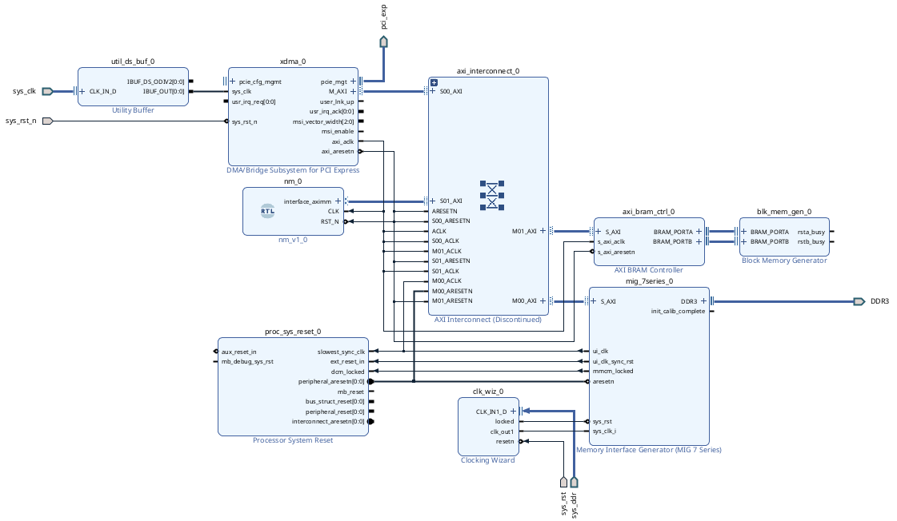

# Num Munge

My personal FPGA playground, used to experiment with my [Alnix AX7A200B](https://www.en.alinx.com/Product/FPGA-Development-Boards/Artix-7/AX7A200B.html).

[BSV Source](./nm_bsv/src/Nm.bsv)

[dma_odin](./dma_odin/main.odin)

- [x] PCIE/DMA connection to on board RAM using Xilinx IP.
- [x] Basic host script to talk to PCIE/DMA.
- [x] Basic Bluespec design to integrate with DMA through AXI.
- [ ] Tcl build script for Vivado.
- [ ] Update Bluespec design for numerical simulation.
- [ ] Update host script for interacting with numerical simulation.

